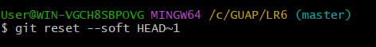

# Отчет по лабораторной работе №6
### Еремина К.О.  Группа № 4316

---

## Цель лабораторной работы: 
Изучение базовых возможностей системы управления версиями, опыт работы с Git Api, опыт работы с локальным и удаленным репозиторием. 

## 1. Создание аккаунта на GitHub
Аккаунт успешно создан на [GitHub] и настроен клиент git.

## 2. Копирование репозитория (Fork)
Сделана копия в личное хранилище из оригинального репозитория
https://github.com/Kurtyanik/LR6/ с помощью кнопки **Fork**. 

## 3. Клонирование репозитория и пулл изменений 

![Клонирование и пулл] (screenshots/3.jpg)

# 4. Вывод истории коммитов для каждой из веток

- Так как по умолчанию ветка всего одна - то история только для  ветки master.

## 5. Проверка ветки с помощью git status
 
- При проверке видим, что незафиксированных файлов нет.

## 6. Создание и разрешение конфликта при слиянии веток

- В изначальном репозиторие была всего одна ветка, чего недостаточно, для конфликтной ситуаци, поэтому создём ещё одну ветку на которой создаём файл file2.txt и пишем в нём "hello".

- Далее создаём такой же файл file2.txt в master и пишем в нем "goodbye", потом выполняем слияние и получаем конфликт.

- Конфликт внутри файла выглядит так:
  

- Конфлик решён, путём самостоятельного внесения изменений в файл и сохранения изменений.
  

## 7. Фиксация изменений после разрешения конфликта и удаление ненужной ветки

## 8. Откат последнего коммита

## 9. Использованные команды
- git clone https://github.com/username/repo.git - Клонирование удалённого репозитория на локальный носитель
- git checkout -b new-branch - Создание и переход на созданную ветку
- git add . - Фиксация файлов (в данной вариации всех незафиксированных файлов)
- git add FileName - Фиксация файла
- git commit -m "Added new feature" - Создание комментария 
- git push origin new-branch - отправка коммитов в удалённый репозиторий

## 10. Получение истории операций в форматированном виде

# Вывод:
В ходе выполнения лабораторной работы я освоила основные команды Git и GitHub, что существенно упростило управление версиями и совместную работу над проектами. Практика разрешения конфликтов при слиянии веток укрепила мои навыки работы с потенциальными проблемными ситуациями. Написание отчета в формате Markdown показало важность документирования процесса разработки.